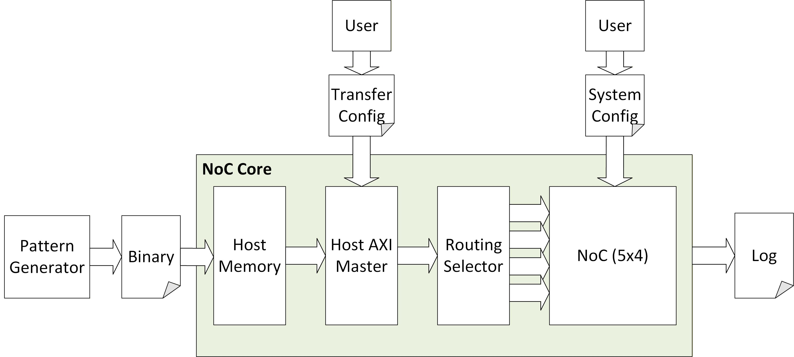

# NoC Behavior Model

A parameterizable Network-on-Chip (NoC) behavioral model for performance analysis and hardware verification.

## Architecture



- **Topology**: 5x4 2D Mesh with physically separated Request and Response networks.
- **V1 Routing**: Single entry/exit via Routing Selector (Column 0 Edge Routers).
- **Routing Algorithm**: Deterministic XY Routing with turn prevention.
- **Simulation**: File-driven, cycle-accurate behavioral model.
- **Verification**: Built-in Golden Data comparison at destination.

## Quick Start

### Installation

```bash
# Clone the repository
git clone <repo_url>
cd noc_behavior_model

# Install dependencies
pip install pyyaml pytest
```

### Run a Demo (Host-to-NoC)

```bash
# Generate payload and run a multi-transfer simulation
make quick
```

### Run a Demo (NoC-to-NoC)

```bash
# Generate per-node payloads and run neighbor traffic pattern
make gen_noc_payload
make sim_noc_neighbor
```

## Documentation

| Document | Description |
|----------|-------------|
| [User Guide](user_guide.md) | Full manual (Installation, Modes, API, Customization) |
| [Architecture Overview](docs/design/00_overview.md) | High-level system design |
| [Design Docs](docs/design/) | Detailed component specifications |

## Performance Visualization

Generate charts from your simulation results:

```bash
make viz_all
```

Outputs are saved to `output/charts/` and `output/metrics/`.

## License

MIT License - See [LICENSE](LICENSE) for details.
