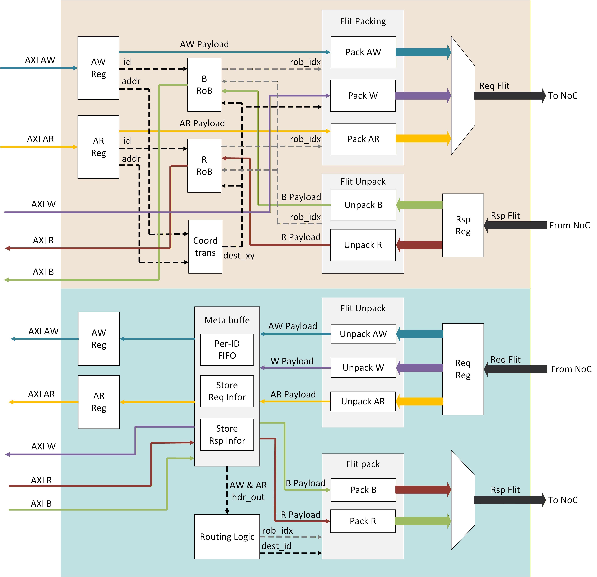

# Network Interface (NI) 規格

處理 AXI 到 NoC 的 Protocol Conversion，包含地址轉換。

---

## 1. Address Translation

AXI 使用 64-bit 地址，NoC 使用 32-bit Local Address 加節點座標。

```
┌──────────────────────────────────────────────────────────────────┐
│                      Address Translation                          │
│                                                                  │
│   AXI Address (64-bit)                                           │
│   ┌────────────────────────────────────────────────────────────┐ │
│   │ [63:40] Reserved │ [39:32] Node ID │ [31:0] Local Address │ │
│   └────────────────────────────────────────────────────────────┘ │
│                              │                    │               │
│                              ▼                    ▼               │
│                    ┌─────────────────┐    ┌─────────────┐        │
│                    │  Address Map    │    │ 32-bit Addr │        │
│                    │  Node ID → (x,y)│    │  Pass-thru  │        │
│                    └────────┬────────┘    └──────┬──────┘        │
│                             │                    │               │
│                             ▼                    ▼               │
│                    dest_coord (x, y)      local_addr (32-bit)    │
└──────────────────────────────────────────────────────────────────┘
```

### Address Format

| Bits | 欄位 | 說明 |
|------|------|------|
| [63:40] | Reserved | 必須為 0 |
| [39:32] | Node ID | 8-bit 節點識別碼 (0-255) |
| [31:0] | Local Address | 32-bit 節點內部地址 |

### Node ID Mapping

```python
class SystemAddressMap:
    """將 Node ID 轉換為 NoC 座標。"""

    def __init__(self, mesh_cols: int, mesh_rows: int, edge_column: int = 0):
        self.mesh_cols = mesh_cols
        self.mesh_rows = mesh_rows
        self.edge_column = edge_column
        self._build_map()

    def _build_map(self):
        """建立 Node ID → (x, y) 對照表，僅 Compute Nodes 有 Node ID。"""
        self.node_map = {}
        node_id = 0
        for y in range(self.mesh_rows):
            for x in range(self.edge_column + 1, self.mesh_cols):
                self.node_map[node_id] = (x, y)
                node_id += 1

    def translate(self, axi_addr: int) -> tuple[tuple[int, int], int]:
        """將 64-bit AXI 地址轉換為 (dest_coord, local_addr)。"""
        node_id = (axi_addr >> 32) & 0xFF
        local_addr = axi_addr & 0xFFFFFFFF

        if node_id not in self.node_map:
            raise ValueError(f"Invalid Node ID: {node_id}")

        dest_coord = self.node_map[node_id]
        return dest_coord, local_addr

# 範例 (5x4 mesh, edge_column=0):
# Node ID 0  → (1,0)    Node ID 4  → (1,1)    ...
# Node ID 1  → (2,0)    Node ID 5  → (2,1)    ...
# Node ID 2  → (3,0)    Node ID 6  → (3,1)    ...
# Node ID 3  → (4,0)    Node ID 7  → (4,1)    ...
```

### Address 範例

| AXI Address (64-bit) | Node ID | Local Addr | Dest Coord |
|---------------------|---------|------------|------------|
| `0x0000_0000_0000_0000` | 0 | 0x0000_0000 | (1, 0) |
| `0x0000_0000_0000_1000` | 0 | 0x0000_1000 | (1, 0) |
| `0x0000_0001_0000_0000` | 1 | 0x0000_0000 | (2, 0) |
| `0x0000_0005_0000_ABCD` | 5 | 0x0000_ABCD | (2, 1) |

### 1.1 NI Address Modes

NI 支援兩種地址模式，依據連接的 AXI Master 類型決定：

| Mode | AXI Master | Address Width | Dest 座標來源 |
|------|------------|---------------|---------------|
| **64b Mode** | Host CPU/DMA | 64-bit | 從 addr[39:32] 經 Address Map 轉換 |
| **32b Mode** | Node CPU/DMA | 32-bit | 從 `awuser`/`aruser` 直接讀取 |

#### 64b Mode (Host NI)

Host AXI Master 使用 64-bit 地址，NI 透過 System Address Map 轉換：

```
┌─────────────────────────────────────────────────────────────┐
│  Host AXI Master (64b)                                       │
│       │                                                      │
│       ▼  AXI AW/AR                                           │
│  ┌─────────────────────────────────────────────────────────┐ │
│  │     Host NI (64b Mode)                                  │ │
│  │                                                         │ │
│  │  ┌──────────────┐      ┌──────────────────┐            │ │
│  │  │ 64b addr     │      │ System Address   │            │ │
│  │  │ [39:32]=Node │─────►│      Map         │─► dest_xy  │ │
│  │  │ [31:0]=Local │      │ NodeID → (x,y)   │            │ │
│  │  └──────────────┘      └──────────────────┘            │ │
│  │         │                                               │ │
│  │         └──────────────────────────────────► 32b addr  │ │
│  │                                                         │ │
│  │  awuser/aruser: 未使用 (ignored)                        │ │
│  └─────────────────────────────────────────────────────────┘ │
└─────────────────────────────────────────────────────────────┘
```

#### 32b Mode (Local NI)

Node 內部 AXI Master (CPU/DMA) 使用 32-bit 地址，dest 座標經由 AXI user 信號傳遞：

```
┌─────────────────────────────────────────────────────────────┐
│  Local AXI Master (32b) - Node CPU/DMA                       │
│       │                                                      │
│       ▼  AXI AW/AR                                           │
│  ┌─────────────────────────────────────────────────────────┐ │
│  │     Local NI (32b Mode)                                 │ │
│  │                                                         │ │
│  │  ┌──────────────┐                                      │ │
│  │  │ 32b addr     │──────────────────────────► 32b addr  │ │
│  │  └──────────────┘                                      │ │
│  │                                                         │ │
│  │  ┌──────────────┐      ┌──────────────────┐            │ │
│  │  │ awuser/aruser│─────►│  Dest Decoder    │─► dest_xy  │ │
│  │  │ [4:3]=dest_y │      │  Extract (x, y)  │            │ │
│  │  │ [2:0]=dest_x │      └──────────────────┘            │ │
│  │  └──────────────┘                                      │ │
│  └─────────────────────────────────────────────────────────┘ │
└─────────────────────────────────────────────────────────────┘
```

#### AXI User Signal Format (32b Mode)

對於 5x4 Mesh，所需最小位元數：

| Bits | 欄位 | 說明 |
|------|------|------|
| [2:0] | dest_x | 目標 X 座標 (0-4, 3 bits) |
| [4:3] | dest_y | 目標 Y 座標 (0-3, 2 bits) |

> **總計**: 5 bits。位元數依 Mesh 大小調整。

#### Mode 選擇

NI 的地址模式由系統配置決定：

| 位置 | 預設 Mode | 說明 |
|------|-----------|------|
| Host NI | 64b Mode | Host CPU/DMA 使用 64b 地址空間 |
| Compute Node NI | 32b Mode | Node CPU/DMA 僅需 32b 本地地址 |

> **V1 限制**: 目前 V1 架構中，Compute Node 無 CPU/DMA，故 32b Mode 未啟用。

#### Flit 座標打包

無論使用哪種地址模式，NI 都會將座標資訊打包進 Flit：

```
AXI Request ──► NI ──► Flit
                       ├── src: (src_x, src_y)   ← 本地座標
                       ├── dest: (dest_x, dest_y) ← 64b: Address Map / 32b: AXI user
                       └── payload: ...
```

兩種模式差異僅在於 **dest 座標的來源**，Flit 格式一致。

---

## 2. 功能模組 (Slave NI + Master NI)

NI 包含**兩個獨立模組**: **Slave NI** 與 **Master NI**，分別處理不同方向的資料流。



### Slave NI (上半部)

- **AXI Interface**: AXI Slave (接收本地 AXI Master 請求)
- **功能**:
  - Flit Packing: AXI AW/AR/W → Req Flit → **Request Router**
  - Flit Unpacking: **Response Router** → Rsp Flit → AXI B/R
- **關鍵元件**:
  - `AW/AR Spill Reg`: AXI 地址通道緩衝
  - `W Payload Store`: Write Data 緩衝
  - `B RoB / R RoB`: Reorder Buffer，追蹤未完成交易，使用 `rob_idx`
  - `Coord Trans`: 地址轉換 (addr → dest_xy)，產生 `rob_idx`
  - `Pack AW/AR/W`: 組裝 Request Flit
  - `Unpack B/R`: 拆解 Response Flit

### Master NI (下半部)

- **AXI Interface**: AXI Master (發送請求至本地 AXI Slave Memory)
- **功能**:
  - Flit Unpacking: **Request Router** → Req Flit → AXI AW/AR/W
  - Flit Packing: AXI B/R → Rsp Flit → **Response Router**
- **關鍵元件**:
  - `Per-ID FIFO`: 依 AXI ID 儲存來自 NoC 的請求資訊
  - `Store Req Info`: 暫存請求資訊供 Response 配對
  - `AW/AR Spill Reg`: 輸出 AXI 地址通道緩衝
  - `Unpack AW/AR/W`: 拆解 Request Flit
  - `Routing Logic`: 從 Header 提取 `rob_idx`, `dest_id` 供 Response 路由
  - `Store Rsp Info`: 暫存 Response 資訊
  - `Pack B/R`: 組裝 Response Flit

---

## 3. 資料路徑

### Request Path (AXI Master → AXI Slave)

```
來源                                                              目的
AXI Master ──► Slave NI ──► Request Router ──► Master NI ──► AXI Slave (Memory)
              (Flit Pack)                      (Flit Unpack)
```

### Response Path (AXI Slave → AXI Master)

```
目的                                                              來源
AXI Slave (Memory) ──► Master NI ──► Response Router ──► Slave NI ──► AXI Master
                      (Flit Pack)                        (Flit Unpack)
```

### 完整 Write 交易流程

```
┌────────────────────────────────────────────────────────────────────────────────────┐
│  Host/Node A                        NoC                        Node B              │
│  (AXI Master)                                                  (Memory)            │
│       │                                                            │               │
│       │  AXI AW/W     ┌──────────┐      Req Flit     ┌──────────┐  │  AXI AW/W     │
│       ├──────────────►│ Slave NI │─────────────────►│ Master NI │──┼─────────────►│
│       │               └──────────┘   Req Router     └──────────┘  │               │
│       │                                                            │               │
│       │  AXI B        ┌──────────┐      Rsp Flit     ┌──────────┐  │  AXI B        │
│       │◄──────────────│ Slave NI │◄─────────────────│ Master NI │◄─┼──────────────│
│       │               └──────────┘   Rsp Router     └──────────┘  │               │
└────────────────────────────────────────────────────────────────────────────────────┘
```

---

## 4. NI 配置

不同位置的 NI 配置:

| 位置 | Slave NI | Master NI | 說明 |
|------|:--------:|:---------:|------|
| **Host NI** | ✓ | ✗ | Host Memory 不接受來自 NoC 的寫入 |
| **Compute Node NI** | ✓* | ✓ | 完整雙向支援 |

> *V1: Compute Node Slave NI 未啟用 (節點內無 AXI Master)，保留供未來擴展。

### V1 架構限制

- Compute Nodes 僅包含 Memory (AXI Slave)
- 無 CPU/DMA (AXI Master) 元件
- 僅 Master NI 路徑啟用

### 未來擴展 (節點內部 AXI Subsystem)

```
┌─────────────────────────────────────────────────────────────────┐
│                     Compute Node (Future)                        │
│                                                                 │
│   ┌─────────────────────────────────────────────────────────┐   │
│   │                    Local AXI Bus                        │   │
│   │   ┌─────────┐   ┌─────────┐   ┌─────────┐              │   │
│   │   │  CPU    │   │  DMA    │   │ Accel.  │  AXI Masters │   │
│   │   └────┬────┘   └────┬────┘   └────┬────┘              │   │
│   │        │             │             │                    │   │
│   │        └─────────────┴─────────────┘                    │   │
│   │                      │                                  │   │
│   │               ┌──────┴──────┐                           │   │
│   │               │  AXI XBAR   │                           │   │
│   │               └──────┬──────┘                           │   │
│   │                      │                                  │   │
│   │        ┌─────────────┼─────────────┐                    │   │
│   │        │             │             │                    │   │
│   │   ┌────┴────┐   ┌────┴────┐   ┌────┴────┐              │   │
│   │   │  NI     │   │ Memory  │   │ Periph. │  AXI Slaves  │   │
│   │   │(Slave+  │   │         │   │         │              │   │
│   │   │ Master) │   │         │   │         │              │   │
│   │   └─────────┘   └─────────┘   └─────────┘              │   │
│   └─────────────────────────────────────────────────────────┘   │
│                      │                                          │
│                      │ NoC Connection                           │
│                      ▼                                          │
└─────────────────────────────────────────────────────────────────┘

支援的資料流向:
  ✓ Host → Node Memory (目前)
  ✓ Node CPU/DMA → Other Node Memory (未來)
  ✓ Node → Node 雙向 (未來)
  ✗ Node → Host Memory (設計禁止)
```

---

## 5. API 定義

```python
class SlaveNI:
    """Slave NI: 連接本地 AXI Master，將請求轉換為 NoC Flits。"""

    # 接收本地 AXI Master 請求
    def process_aw(self, aw: AXI4.AW) -> None: ...
    def process_ar(self, ar: AXI4.AR) -> None: ...
    def process_w(self, w: AXI4.W) -> None: ...

    # 輸出至 Request Router
    def get_req_flit(self) -> Optional[Flit]: ...

    # 接收 Response Router 的回應
    def receive_rsp_flit(self, flit: Flit) -> None: ...

    # 回傳 Response 給本地 AXI Master
    def get_b_response(self) -> Optional[AXI4.B]: ...
    def get_r_response(self) -> Optional[AXI4.R]: ...


class MasterNI:
    """Master NI: 接收 NoC Flits，發送 AXI 請求至本地 Memory。"""

    # 接收 Request Router 的請求
    def receive_req_flit(self, flit: Flit) -> None: ...

    # 發送至本地 Memory (AXI Slave)
    def get_aw_request(self) -> Optional[AXI4.AW]: ...
    def get_ar_request(self) -> Optional[AXI4.AR]: ...
    def get_w_data(self) -> Optional[AXI4.W]: ...

    # 接收 Memory Response
    def process_b(self, b: AXI4.B) -> None: ...
    def process_r(self, r: AXI4.R) -> None: ...

    # 輸出至 Response Router
    def get_rsp_flit(self) -> Optional[Flit]: ...


class NetworkInterface:
    """完整 NI = Slave NI + Master NI。"""

    def __init__(self, config: NIConfig):
        self.slave_ni = SlaveNI(config)   # 連接本地 AXI Master
        self.master_ni = MasterNI(config) # 連接本地 AXI Slave (Memory)
```

---

## 6. 參數

```python
class NIConfig:
    # 地址
    axi_addr_width: int = 64       # AXI 地址寬度 (bits)
    local_addr_width: int = 32     # NoC Local Address 寬度 (bits)
    node_id_bits: int = 8          # Node ID 欄位寬度 (bits)

    # 交易
    max_outstanding: int = 16      # 最大未完成交易數
    reorder_buffer_size: int = 32  # Reorder Buffer 容量
    axi_data_width: int = 64       # AXI 資料寬度 (bits)
    axi_id_width: int = 4          # AXI ID 寬度 (bits)
    burst_support: bool = True     # AXI Burst 支援
    max_burst_len: int = 256       # 最大 Burst 長度
```

---

## 7. Reorder Buffer

```python
class ReorderEntry:
    axi_id: int           # AXI 交易 ID
    expected_seq: int     # 預期序號
    received: list[Flit]  # 已接收的 Responses
    completed: bool       # 準備輸出
```

**規則**: 相同 AXI ID 的交易必須依序完成。

---

## 相關文件

- [系統概述](00_overview.md)
- [Flit 格式](04_flit.md)
- [設計決策](08_design_decisions.md) - AXI4 Interface Model
